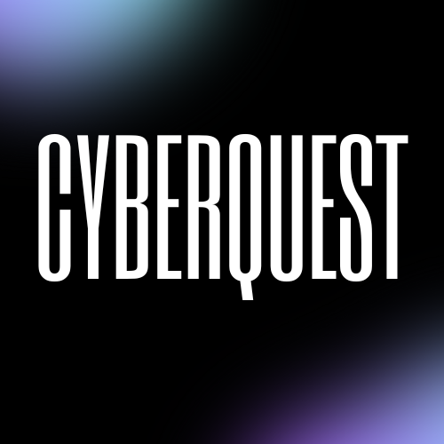

# CyberQuest 🛡️

**CyberQuest** is a free, educational cybersecurity awareness game designed to test your knowledge of digital defense, encryption, and network security.



## ✨ Features
- **Interactive Quiz**: Test your skills with randomized cybersecurity questions
- **Two Difficulty Levels**: Beginner and Advanced
- **35 Curated Questions**: Covering phishing, passwords, encryption, and more
- **Cyber Aesthetic**: Immersive dark mode with purple/blue neon visuals
- **Educational Focus**: 100% free - education should be accessible to all

## 🚀 Getting Started

### Prerequisites
- Node.js (v18 or higher)

### Installation

1. Clone the repository:
```bash
git clone https://github.com/aryancodesit/CyberQuest.git
cd cyberquest
```

2. Install dependencies:
```bash
npm install
```

3. Run the development server:
```bash
npm run dev
```

4. Open [http://localhost:3000](http://localhost:3000) in your browser

## 🛠️ Tech Stack
- **Frontend**: Next.js 14, React, TailwindCSS v3
- **UI Components**: Framer Motion, Lucide React
- **Styling**: Custom cyber-themed design system

## 📦 Version
**v1.0.0** - Initial release

## 🗺️ Roadmap (v2.0)
- 15-question tiered difficulty system
- Mobile-responsive design
- Manual progression with explanation views
- localStorage persistence
- Enhanced UX/UI

## 📄 License
MIT

---
*Developed for educational purposes - making cybersecurity knowledge accessible to everyone.*
